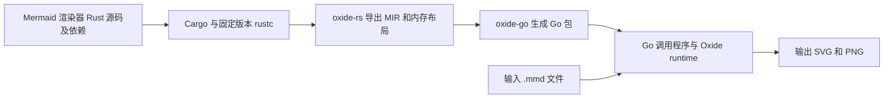

# 使用教程：将 Mermaid 渲染器从 Rust 翻译为 Go

本教程使用 Oxide 翻译 `mermaid-rs-renderer`，然后在 Go 程序中读取 `.mmd` 文件，生成 SVG 和 PNG。解析、布局和图片编码都来自翻译后的 Rust 实现及其依赖。

这里的“翻译”指 Rust → Go 代码转换。Mermaid 图表源码仍是渲染器的输入，例如 `flowchart LR; A --> B`。



## 1. 准备环境并构建 Oxide

需要 Linux amd64 或 arm64、Go 1.27.1、Python 3.12+，以及 rustc 可以使用的系统链接器（通常由 `cc` 提供）。项目也支持具有安全 tar 解压功能的 Python 3.11 版本。首次构建会联网下载固定的 Rust 工具链及依赖。

保留当前项目的相邻目录关系；示例的 Cargo 依赖通过相对路径引用渲染器：

```text
lang/
├── oxide/
│   ├── oxide-rs/
│   ├── oxide-go/
│   └── fixtures/renderer/
└── mermaid-rs-renderer/
    └── Cargo.toml
```

以下命令在同一个 shell 中依次执行。从 `oxide` 目录开始；按你的实际位置修改第一行：

```sh
cd /home/bxd/GolandProjects/lang/oxide
export OXIDE_ROOT="$PWD"

go version
python3 --version
cc --version

./oxide-rs/build.sh
(
  cd "$OXIDE_ROOT/oxide-go"
  GOWORK=off go build -o "$OXIDE_ROOT/bin/oxide" ./cmd/oxide
)

"$OXIDE_ROOT/bin/oxide-rs" --print-sysroot
"$OXIDE_ROOT/bin/oxide" help
```

`oxide-rs/build.sh` 会安装项目固定的 nightly，并构建 Rust 前端。`bin/oxide` 是 Go 编写的命令行入口。无需自行切换系统的 rustup 默认工具链。

完整渲染器的可达调用图约有十万个函数，首次翻译和 Go 编译需要时间，工具链、MIR 和编译缓存需要数 GiB 磁盘空间。下面把临时编译文件放在工作区，避免较小的 `/tmp` 空间不足。

## 2. 理解要翻译的 Rust 入口

本例直接使用仓库提供的 [Cargo.toml](../fixtures/renderer/Cargo.toml) 和 [lib.rs](../fixtures/renderer/lib.rs)，无需修改上游渲染器。该 Cargo 包名为 `oxide_renderer_fixture`，依赖 `mermaid-rs-renderer`，保留默认 features。

包装层提供两个入口：

| Rust 函数 | 生成的 Go 入口 | 用途 |
| --- | --- | --- |
| `oxide_renderer_fixture::render_svg` | `RenderSvg` | 接收输入地址和长度，将 SVG 写入调用者提供的缓冲区，返回完整 SVG 长度 |
| `oxide_renderer_fixture::write_png` | `WritePng` | 接收输入和路径的地址、长度，通过原始渲染器写 PNG 文件 |

这些入口采用“地址 + 长度”的接口，方便 Go 分配存储并传参。渲染器内部仍使用原本的 Rust `String`、集合和依赖库；Oxide 会沿入口的调用图一起翻译。指定 `-roots` 可以明确导出哪些本地 Rust 函数。

## 3. 翻译成 Go 包

本教程先在本机架构上运行。amd64 主机对应 `linux/amd64`，arm64 主机对应 `linux/arm64`：

```sh
export OXIDE_ARCH="$(go env GOHOSTARCH)"
export OXIDE_DEMO="$OXIDE_ROOT/.cache/mermaid-tutorial/$OXIDE_ARCH"
mkdir -p "$OXIDE_DEMO/go-tmp" "$OXIDE_DEMO/go-cache"

CARGO_TARGET_DIR="$OXIDE_DEMO/cargo-target" \
  "$OXIDE_ROOT/bin/oxide" translate \
  -frontend "$OXIDE_ROOT/bin/oxide-rs" \
  -manifest "$OXIDE_ROOT/fixtures/renderer/Cargo.toml" \
  -package oxide_renderer_fixture \
  -target "linux/$OXIDE_ARCH" \
  -roots oxide_renderer_fixture::render_svg,oxide_renderer_fixture::write_png \
  -out "$OXIDE_DEMO/renderer"
```

成功后，`renderer/` 包含：

```text
renderer/
├── oxide.mir.json       # Rust 前端导出的 MIR，可用于重新生成 Go
├── oxide_gen_00000.go   # Go 源码，按编号拆成多个文件
├── oxide_gen_00001.go
├── ...
└── oxide_alloc.bin     # 静态分配镜像，由生成代码通过 go:embed 引用
```

此命令生成的 Go 包名是 `oxide_renderer_fixture`，不会自动创建 `go.mod` 或可执行程序。保留全部生成的 `.go` 文件和 `oxide_alloc.bin`，下一步创建调用程序。

两个子命令的 `-package` 含义不同：`translate -package` 选择 **Cargo 包**；`emit -package` 指定 **生成的 Go 包名**。`-roots` 使用完整 Rust 名称，逗号后不要加空格。默认保留整数溢出检查；`-overflow-checks=false` 可关闭，本教程保持默认值。

## 4. 创建 Go 调用程序

在生成包的上一层创建模块，让 `renderer/` 成为它的子包。模块中的 `replace` 指向本地 Oxide runtime 源码：

```sh
cd "$OXIDE_DEMO"
export GOWORK=off
export CGO_ENABLED=0
export GOOS=linux
export GOARCH="$OXIDE_ARCH"
export GOTMPDIR="$OXIDE_DEMO/go-tmp"
export GOCACHE="$OXIDE_DEMO/go-cache"

# 新建示例目录时执行一次；已存在 go.mod 时跳过 go mod init。
go mod init example.com/mermaid-demo
go mod edit -go=1.27.1
go mod edit -require=github.com/csbxd/oxide/oxide-go@v0.0.0
go mod edit "-replace=github.com/csbxd/oxide/oxide-go=$OXIDE_ROOT/oxide-go"
mkdir -p cmd/render
```

将下面内容保存为 `$OXIDE_DEMO/cmd/render/main.go`。导入时使用别名 `renderer`，便于调用生成的包：

```go
package main

import (
    "fmt"
    "os"
    "path/filepath"
    "unsafe"

    renderer "example.com/mermaid-demo/renderer"
    oxide "github.com/csbxd/oxide/oxide-go/runtime"
)

func putBytes(ctx *oxide.Context, data []byte) uintptr {
    p := ctx.Alloc(uintptr(len(data)), 1)
    copy(unsafe.Slice((*byte)(unsafe.Pointer(p)), len(data)), data)
    return p
}

func run() error {
    if len(os.Args) != 3 {
        return fmt.Errorf("usage: render INPUT.mmd OUTPUT_PREFIX")
    }
    source, err := os.ReadFile(os.Args[1])
    if err != nil {
        return err
    }
    prefix, err := filepath.Abs(os.Args[2])
    if err != nil {
        return err
    }
    if err := os.MkdirAll(filepath.Dir(prefix), 0o755); err != nil {
        return err
    }

    ctx := oxide.NewContext()
    defer ctx.Close()
    input := putBytes(ctx, source)
    inputLen := uintptr(len(source))

    // 第一次渲染查询所需长度；容量为 0 时允许输出地址为 0。
    size := renderer.RenderSvg(ctx, input, inputLen, 0, 0)
    output := ctx.Alloc(size, 1)
    written := renderer.RenderSvg(ctx, input, inputLen, output, size)
    if written != size {
        return fmt.Errorf("SVG length changed: %d -> %d", size, written)
    }
    svg := unsafe.Slice((*byte)(unsafe.Pointer(output)), size)
    if err := os.WriteFile(prefix+".svg", svg, 0o644); err != nil {
        return err
    }

    pngPath := []byte(prefix + ".png")
    path := putBytes(ctx, pngPath)
    renderer.WritePng(ctx, input, inputLen, path, uintptr(len(pngPath)))
    fmt.Printf("wrote %s.svg and %s.png\n", prefix, prefix)
    return nil
}

func main() {
    if err := run(); err != nil {
        fmt.Fprintln(os.Stderr, err)
        os.Exit(1)
    }
}
```

`Context` 提供具有稳定地址的 Rust 存储；不能直接把 Go `string` 或 `[]byte` 当作 Rust 参数。退出时通过 `defer ctx.Close()` 释放 Context。这个示例先查询 SVG 长度再填充缓冲区，因此 SVG 会渲染两次；PNG 入口也会自行渲染。

生成的导出入口会把未处理的 Rust panic 转成 Go panic，所以调用失败时不会正常返回，也不能靠调用后的 `ctx.Failed()` 检查来捕获。示例保留 panic 传播；需要转换为业务错误时，可在 Go 调用边界使用 `defer` / `recover`。包装层的 `expect` 也意味着无效输入或 PNG 写入失败可能触发 panic。

`svg` 切片引用 Context 的存储，必须在关闭 Context 或恢复对应存储标记之前写出或复制。批量调用时可以通过 `ctx.Mark()` / `ctx.Restore(mark)` 复用存储；同一个 Context 不能并发使用。

## 5. 编译并生成第一张图

```sh
cd "$OXIDE_DEMO"
gofmt -w cmd/render/main.go
go mod tidy
mkdir -p bin
go build -o bin/render ./cmd/render

cat > demo.mmd <<'EOF'
flowchart LR
    A[Read Mermaid] --> B[Render in Go]
    B --> C[SVG]
    B --> D[PNG]
EOF

./bin/render demo.mmd output/demo
ls -lh output/demo.svg output/demo.png
```

预期生成 `output/demo.svg` 和 `output/demo.png`。编译成功后，运行这个二进制无需启动 Rust 编译器；翻译得到的渲染代码和 runtime 已编入 Go 程序。

也可以直接使用仓库中的输入：

```sh
"$OXIDE_DEMO/bin/render" \
  "$OXIDE_ROOT/fixtures/renderer/cases/flowchart.mmd" \
  "$OXIDE_DEMO/output/flowchart"
```

## 6. 验证与原生 Rust 输出一致

仓库已有完整的差分测试流程。构建完第 1 步的 Rust 前端后就能独立执行，不要求先完成手动示例：

```sh
cd "$OXIDE_ROOT"
python3 fixtures/renderer/test.py
```

脚本在**当前主机架构**上编译原生 Rust 并生成参考图，随后导出 MIR、生成 Go、运行 Go 测试。现有 72 个 `.mmd` 输入分别比较 SVG 和 PNG，共 144 个文件逐字节比较；还会检查存储标记恢复和预热调用的 Go 分配计数。成功时 Go 测试输出包含 `PASS`。

主要产物保留在以下位置：

| 路径（相对于 `oxide/`） | 内容 |
| --- | --- |
| `.cache/renderer-conformance/reference/` | 原生 Rust 生成的 SVG / PNG |
| `.cache/renderer-conformance/oxide.mir.json` | 缓存的 MIR |
| `.cache/renderer-conformance/go/` | 生成的 Go 包及测试 |
| `.cache/renderer-conformance/go/actual/` | Go 实际生成的 SVG / PNG |

这些是验收脚本自己的缓存，与手动教程的 `.cache/mermaid-tutorial/` 分开。可以再核对手动调用程序输出的同一个输入：

```sh
cmp "$OXIDE_DEMO/output/flowchart.svg" \
    "$OXIDE_ROOT/.cache/renderer-conformance/reference/flowchart.svg"
cmp "$OXIDE_DEMO/output/flowchart.png" \
    "$OXIDE_ROOT/.cache/renderer-conformance/reference/flowchart.png"
```

两条命令均无输出且退出码为 0，表示字节一致。参考文件应来自相同源码、配置和主机环境；字体等环境变化也可能影响结果。测试覆盖情况见 [MILESTONES.md](../MILESTONES.md)，不能据此推断所有 Rust 功能或上游 API 均已支持。

## 7. 修改后如何重跑

只改 Go 调用代码：在 `$OXIDE_DEMO` 中重新 `go build -o bin/render ./cmd/render`。

修改 Rust 包装层或上游 Rust 代码：重新执行第 3 步的 `translate`，再编译 Go。旧 MIR 不会包含新的 Rust 逻辑。

只修改 Oxide 的 Go 代码生成器：先重建 `bin/oxide`，然后可以使用已有 MIR 跳过 Rust 导出阶段：

```sh
"$OXIDE_ROOT/bin/oxide" emit \
  -mir "$OXIDE_DEMO/renderer/oxide.mir.json" \
  -package oxide_renderer_fixture \
  -out "$OXIDE_DEMO/renderer"
```

验收脚本也支持分阶段重跑：

```sh
cd "$OXIDE_ROOT"
python3 fixtures/renderer/test.py --stage native  # 仅生成原生 Rust 参考图
python3 fixtures/renderer/test.py --stage export  # 仅重新导出 MIR
python3 fixtures/renderer/test.py --stage go      # 使用缓存 MIR/参考图，重新生成 Go 并测试
```

`--stage go` 需要已有的 MIR 和 `reference/`。如果 Rust 源码或工具链发生变化，优先重新运行完整流程，保证参考图和生成代码来自同一版本。

## 常见问题

| 现象 | 检查方式 |
| --- | --- |
| 找不到 `mermaid-rs-renderer/Cargo.toml` | 检查第 1 步的相邻目录结构，以及 fixture 中的 path dependency |
| `oxide-rs frontend not found` | 先运行构建脚本，并用 `-frontend` 传入 `bin/oxide-rs` 的绝对路径 |
| `build constraints exclude all Go files` | 核对 `-target`、`GOOS` 和 `GOARCH`；每个架构使用独立生成目录 |
| 编译时缺少 `oxide_alloc.bin` | 将它与全部生成的 Go 文件保持在同一目录，再编译 |
| Go runtime 模块无法解析 | 核对 `go.mod` 的 `require` 和本地 `replace`，再运行 `go mod tidy` |
| 拷入现有 `generated_test.go` 后包名冲突 | 验收脚本使用包名 `rendererfixture`；手动 `translate` 使用 `oxide_renderer_fixture`，优先让验收脚本管理自己的输出目录 |
| 渲染入口抛出 panic | 检查输入 Mermaid、UTF-8 编码及输出路径；包装层对解析和写文件错误使用了 Rust `expect` |
| 编译提示磁盘空间不足 | 检查 `GOTMPDIR` 和 `GOCACHE` 所在磁盘是否有空间，确认当前 shell 仍设置了第 4 步的变量 |

迁移其他 Rust 库时，可以沿用这里的流程：编写清晰的本地入口，指定 roots 翻译，让 Go 通过 Context 传参，再用同输入的原生 Rust 结果做对照。
